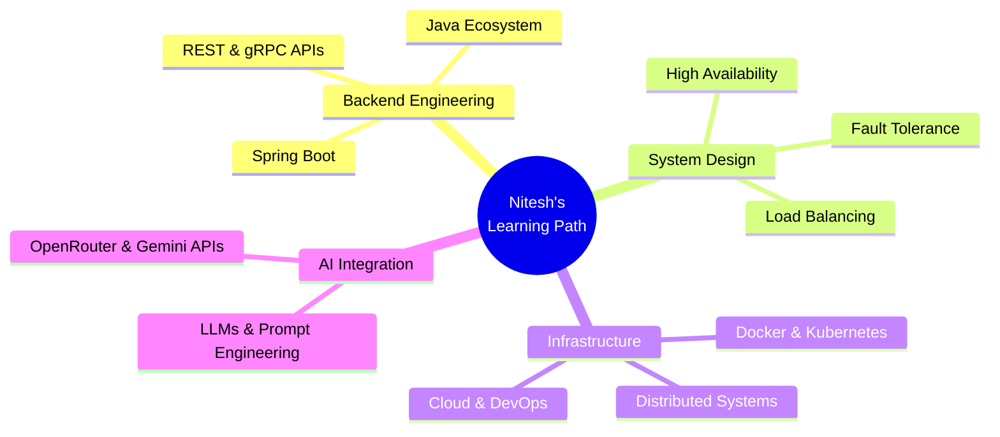

<div align="center">

<!-- Animated Header Banner -->


<!-- Animated Typing SVG -->


<br/>

<!-- Profile Views & Followers -->

&nbsp;


<br/><br/>

<!-- Social Links -->
[](https://www.linkedin.com/in/nitesh7343/)
[](https://leetcode.com/u/paandaa/)
[](https://codeforces.com/profile/Nitzyy)
[](https://www.geeksforgeeks.org/profile/nitesh7343)
[](https://github.com/Nitesh7343)

</div>

---

<!-- About Me Section -->
##  About Me


```yaml
name: Nitesh
location: Mathura, Uttar Pradesh, India
education: B.Tech Computer Science @ GLA University

role: Software Engineer || Full Stack Developer (MERN)
focus:
  - Scalable Web Applications
  - AI-Powered Products
  - Backend Engineering & System Design

stats:
  dsa_problems: 750+
  codeforces_rating: 1177

currently_learning:
  - Spring Boot & Java Ecosystem
  -Design Patterns
  - System Design
  - System Architecture
  - Distributed Systems & Cloud
  - Artificial Intelligence & Machine Learning

goal: Software Engineer 🎯
available: true
```

<br clear="right"/>

---

<!-- Animated Divider -->


## 🛠️ Tech Stack & Tools

<div align="center">

### 💻 Languages
<p>
  
</p>

### 🌐 Frontend
<p>
  
</p>

### ⚙️ Backend & Databases
<p>
  
</p>

### 🔧 DevOps, Tools & Platforms
<p>
  
</p>

### 📚 Currently Learning
<p>
  
</p>

</div>

---


## 💼 Featured Projects

<div align="center">
<table>
<tr>
<td width="50%" valign="top">

### 🤖 [Intervio](https://github.com/Nitesh7343/Intervio)
> **AI-Driven Interview Simulation Platform**

 

A cutting-edge platform helping candidates ace real-world interviews with intelligent AI feedback and analysis.

**✨ Key Features:**
- 📄 Resume-based smart question generation
- 🎙️ Real-time AI evaluation with Speech-to-Text
- 💳 Razorpay payment gateway integration
- 📊 Granular performance analytics dashboard

**🏗️ Stack:**
`React.js` `Node.js` `Express.js` `MongoDB` `Firebase` `OpenRouter API` `Razorpay`

</td>
<td width="50%" valign="top">

### 🏨 [Stayora](https://github.com/Nitesh7343/Stayora)
> **Full-Stack Secure Booking Engine**

 

A robust property management engine with enterprise-level security and optimized data streaming.

**✨ Key Features:**
- 🔐 Role-Based Access Control (RBAC)
- 🔑 JWT secure authentication flow
- ☁️ Cloudinary media CDN integration
- ⚡ Server-side cursor pagination

**🏗️ Stack:**
`Node.js` `Express.js` `MongoDB` `EJS` `Cloudinary`

</td>
</tr>
</table>
</div>

---


## 📊 GitHub Analytics

<div align="center">

<table>
<tr>
<td>
  
</td>
<td>
  
</td>
</tr>
</table>

<br/>

<!-- Streak Stats — using demolab for reliability -->


<br/>

<!-- Activity Graph -->


</div>

---


<div align="center">


</div>

---


## ⚔️ Competitive Programming

<div align="center">

<table>
<tr>
<td align="center">

### 🟡 LeetCode
[](https://leetcode.com/u/paandaa/)

</td>
<td align="center" valign="top">

### 📈 CP Stats at a Glance

<br/>

| Platform | Handle | Rating / Stats |
|:---:|:---:|:---:|
| 🟡 **LeetCode** | [paandaa](https://leetcode.com/u/paandaa/) | 750+ Problems |
| 🔵 **Codeforces** | [Nitzyy](https://codeforces.com/profile/Nitzyy) | **1177** Rating |
| 🟢 **GeeksForGeeks** | [nitesh7343](https://www.geeksforgeeks.org/profile/nitesh7343) | Active |

<br/>

```
🏆 Total Problems Solved: 750+
⚡ Codeforces Max Rating: 1177
🎯 Consistency: Multi-platform competitor
```

</td>
</tr>
</table>

</div>

---


## 🏆 GitHub Trophies

<div align="center">

<!-- Row 1: Top trophies -->


<br/>

<!-- Row 2: More trophies -->


</div>

---


## 🏅 Achievements & Certifications

<div align="center">
<table>
<tr>
<td width="50%" valign="top">

### 🏆 Hackathons & Milestones

| 🏅 | Achievement |
|:---:|:---|
| 🥇 | **1st Place** — University Hackathon |
| 🚀 | **Finalist** — Smart India Hackathon (SIH) |
| 💡 | **Participant** — Deviathon National Hackathon |
| 🎨 | **Participant** — Adobe India Hackathon |
| 🧠 | **750+ DSA Problems** Solved Across Platforms |
| ⭐ | **1177 Codeforces Rating** |

</td>
<td width="50%" valign="top">

### 📜 Certifications

| 🎓 | Certification |
|:---:|:---|
| ☁️ | **Microsoft Azure Fundamentals** (AZ-900) |
| 📱 | **Meta Android Developer** Professional Certificate |

<br/>

### 🎯 Currently Targeting
```
📌 SDE Internship — 2026
📌 Open Source Contributions
📌 System Design Mastery
```

</td>
</tr>
</table>
</div>

---


## 🌱 Learning Roadmap

<div align="center">



</div>

---


## OK OK lemme tell you a joke 😅

<div align="center">


</div>

---

## Let's Connect 😌!

<div align="center">


**Open to collaborations, internships, and exciting projects!**

[](https://www.linkedin.com/in/nitesh7343/)
[](mailto:niteshsingh7343@gmail.com)

<br/>


</div>

<!-- 
  ====================================================
  SETUP CHECKLIST FOR THIS README:
  ====================================================
  1. ✅ Replace nitesh7343@gmail.com with your actual email
  2. ✅ Set up snake.yml GitHub Action (instructions in snake section)
     → After setup, uncomment the snake SVG line and remove the preview
  3. ✅ Verify your LeetCode handle (paandaa) is correct
  4. ✅ Verify your Codeforces handle (Nitzyy) is correct
  5. ✅ Mermaid mindmap renders on GitHub natively (no setup needed)
  ====================================================
-->
